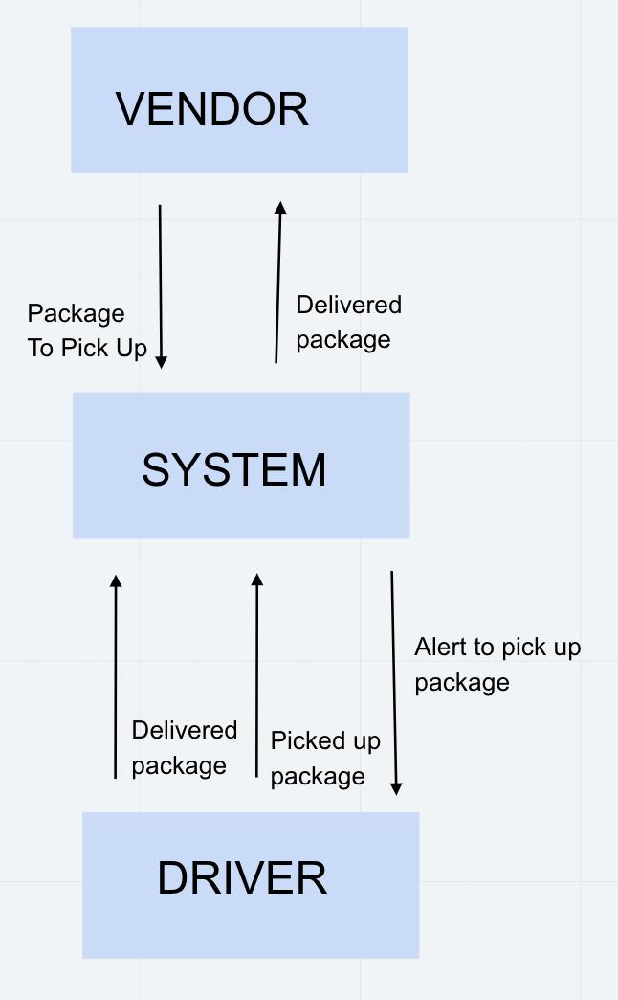

# CAPS

Author: Chris Hamersly  Version: 1.0.3

## Overview
A real-time service that allows for vendors, such as flower shops or restaurants, to alert a system of a package needing to be delivered, for drivers to instantly see what’s in their pickup queue, and then to alert the vendors as to the state of the deliveries (in transit, and then delivered).

## Getting Started
Clone app into local machine.  Install all of the necessary dependencies, by running npm i.  Initialize the file by typing the commands npm init -y into your terminal.   

## Architecture
The application will be created with the following overall architecture and methodologies
  - Node.js
  - Socket.io for realtime event management
  - ES6 Classes and best practices
  - ExpressJS Web Server
  - For simulating pickup requests
  - For simulating delivery scans
  - In-Memory messaging queue
  - Test Driven Development, using Jest
  -  Tests will be runnable locally
  - Tests will auto-execute (CI) in your repo using GitHub actions
  - Tests will use a 3rd party library called supergoose to:
  - “mock” the mongo running database
  - “mock” the running Express server
  - Deployment to Heroku

## Daily Requirements
  - Monday
    1. As a vendor, I want to alert the system when I have a package to be picked up
    1. As a driver, I want to be notified when there is a package to be delivered
    1. As a driver, I want to alert the system when I have picked up a package and it is in transit
    1. As a driver, I want to alert the system when a package has been delivered
    1. As a vendor, I want to be notified when my package has been delivered

  - Tuesday
    1. As a vendor, I want to alert the system when I have a package to be picked up
    1. As a driver, I want to be notified when there is a package to be delivered
    1. As a driver, I want to alert the system when I have picked up a package and it is in transit
    1. As a driver, I want to alert the system when a package has been delivered
    1. As a vendor, I want to be notified when my package has been delivered

  - Wednesday
    1. As a vendor, I want to alert the system when I have a package to be picked up
    1. As a driver, I want to be notified when there is a package to be delivered
    1. As a driver, I want to alert the system when I have picked up a package and it is in transit
    1. As a driver, I want to alert the system when a package has been delivered
    1. As a vendor, I want to be notified when my package has been delivered
  

## Change Log
 - Monday 08-31-2020
 - Tuesday 09.01.2020 - used TCP to connect the apps to eachother. 
 - Wednesday 09.02.2020 - used socket.io to connect the apps to eachother. 
     

